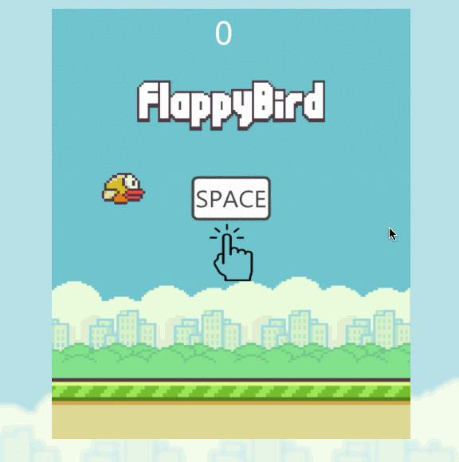

# FlappyBird

An implementation of the Flappybird game, built on Javascript, HTML5 canvas, jQuery, keymaster.js and moment.js library.

* [Live Link](https://dylanpt16.github.io/FlappyBird/)
* [Inspiration](https://en.wikipedia.org/wiki/Flappy_Bird)



# Features
## Using vector length to determine distance between the bird and pipes.

```javascript
  hasBirdCrashedPipe(bird, pipes){
    const [birdX, birdY] = bird.getPositions();
    const {x, y, width, upperPipeHeight, spaceBtwUpAndDown} = pipes.leftMostPipe();
    const closestX  = Math.min(Math.max(birdX, x), x + width);
    const closestUpperPipeHeight = Math.min(birdY, y + upperPipeHeight);
    const closestLowerPipeHeight  = Math.max(birdY, y + upperPipeHeight + spaceBtwUpAndDown);

    const dX  = birdX - closestX;
    const dUpperPipeHeight = birdY - closestUpperPipeHeight;
    const dLowerPipeHeight = birdY - closestLowerPipeHeight;
    // vector length
    const d1 = dX*dX + dUpperPipeHeight*dUpperPipeHeight;
    const d2 = dX*dX + dLowerPipeHeight*dLowerPipeHeight;
    const birdRadius = (BIRD.HEIGHT/2)*(BIRD.HEIGHT/2);
    // determine intersection
    if (birdRadius > d1 || birdRadius > d2) {
      pipeCrashSound.play();
      return true;
    }
    return false;
  }
```

## Using localStorage to keep top 3 scores to motivate users to break the records.

```javascript
    const newRecord = {
      difficulty: (this._difficulty || DIFFICULTY.NORMAL),
      score: newScore,
      time: new moment(),
    };
    this._scores.push(newRecord);
    this._scores = this._scores.sort((i,j)=> j.score - i.score).slice(0,3);;

    window.localStorage.setItem(SCORES, JSON.stringify(this._scores));
```


## There are 3 difficulty modes to challenge skillful players.

* Easy


* Normal


* Hard


